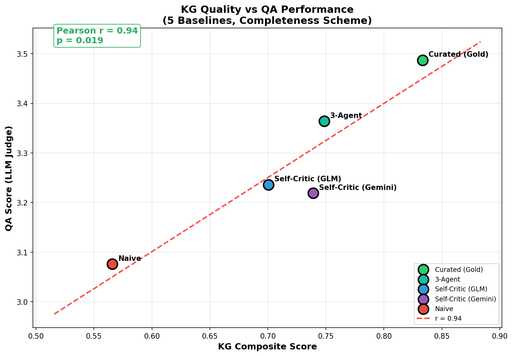

# Clinical GraphRAG Evaluation

Evaluate Knowledge Graph extraction methods for clinical transcripts using GraphRAG QA.

## Hackathon Goal

**Build your own multi-agent KG extraction system** to beat our baselines.

Your task: Design an agentic orchestration pipeline that extracts high-quality Knowledge Graphs from clinical transcripts. We provide the evaluation framework — you bring the innovation.

### Model Restriction

To ensure fair comparison and enable future **local deployment**, KG extraction must use **only these OpenRouter models**:

| Model | Notes |
|-------|-------|
| `z-ai/glm-4.7-flash` | Our baseline model |
| `qwen/qwen3-14b` | |
| `nvidia/nemotron-3-nano-30b-a3b` | |
| `openai/gpt-oss-20b` | |
| `deepseek/deepseek-r1-distill-qwen-32b` | |

See `kg_extraction.py` for API usage reference.

---

## Pipeline Overview


### Stage 1: KG Construction (Your Focus)

| Step | Script | Purpose |
|------|--------|---------|
| **KG Extraction** | `kg_extraction.py` | Extract entities (symptoms, diagnoses, treatments) and relations from each patient's transcript. This is where your multi-agent system comes in. |
| **Entity Resolution** | `dump_graph.py` | Merge per-patient KGs into a unified graph. Uses BGE-M3 embeddings (0.85 cosine threshold) to deduplicate entities like "high blood pressure" = "hypertension". |

### Stage 2: Evaluation (Provided)

| Step | Script | Purpose |
|------|--------|---------|
| **GraphRAG QA** | `graphrag_qa_pipeline.py` | Given a clinical question, retrieve relevant KG triples and generate an answer. Tests if your KG captures the right information. |
| **LLM Judge** | `llm_judge_batch_parallel.py` | 4 LLM judges (GPT/Claude/Gemini/Grok) × 3 trials score each answer on correctness, completeness, faithfulness, and relevance. |

---

## Baseline Results


| Method | Pipeline | Score | Cost |
|--------|----------|-------|------|
| **Curated** | Human curated | 3.49 | $50 |
| **3-Agent** | Extract → Critic → Refiner | **3.36** | $0.18 |
| **Self-Critic [GLM/Gemini]** | LLM extract → Self critique → Merge | 3.24 / 3.22 | $0.12 / $0.50 |
| **Naive** | LLM extract → Merge | 3.08 | $0.05 |
| **Text RAG** | Chunk & embed (no KG) | 2.14 | $0 |

**Takeaway**: 3-Agent achieves **96.5% quality** of human-curated KG at only **$0.18** cost. The key is proper prompt engineering for turn_id format consistency. Can your multi-agent system do even better?

### KG Quality Correlates with QA Performance



| Method | KG F1 (vs Curated) | QA Score |
|--------|-------------------|----------|
| 3-Agent | 0.379 | 3.36 |
| Self-Critic | 0.382 | 3.24 |
| Naive | 0.354 | 3.08 |

**Correlation r = 0.84**: Higher KG entity overlap with curated baseline → better QA performance.

> **Note for Participants**: The LLM Judge evaluation (Step 5) is **expensive** (~$8-10 per full run) and will be executed by hackathon organizers for final scoring. During development, we recommend using **KG Similarity** (`kg_similarity_scorer.py`) as a **low-cost, early-stage proxy** to estimate your KG extraction quality before submission.

---

## Quick Start

```bash
# Step 1: Setup API keys
cp api_keys_example.json api_keys.json  # Add your OpenRouter/Gemini keys

# Step 2: KG Extraction (replace with YOUR method)
python kg_extraction.py --input evaluation_bundle/transcripts --output my_kg/ --method self-critic

# Step 3: Entity Resolution — merge per-patient KGs
python dump_graph.py --input my_kg/ --output my_unified_graph.json

# Step 4: GraphRAG QA — answer 140 clinical questions
python graphrag_qa_pipeline.py --kg my_unified_graph.json --bundle evaluation_bundle/ --output my_results/

# Step 5: LLM Judge — score your answers
python llm_judge_batch_parallel.py --results my_results/ --output my_scores/

# Step 6: Compare to baseline — quick KG quality check
python kg_similarity_scorer.py --student my_unified_graph.json --baseline baseline_curated/unified_graph_curated.json
```

---

## Project Structure

```
├── evaluation_bundle/     # 20 patients × 7 question types (140 QA pairs)
├── baseline_*/            # Pre-computed baselines with full evaluation
├── figures/               # Visualizations
├── kg_extraction.py       # Baseline extraction (naive / self-critic / 3-agent) - USE AS REFERENCE
├── dump_graph.py          # Entity resolution & KG merging
├── graphrag_qa_pipeline.py
├── llm_judge_batch_parallel.py
├── kg_similarity_scorer.py
└── visualize.py           # Generate comparison figures
```
