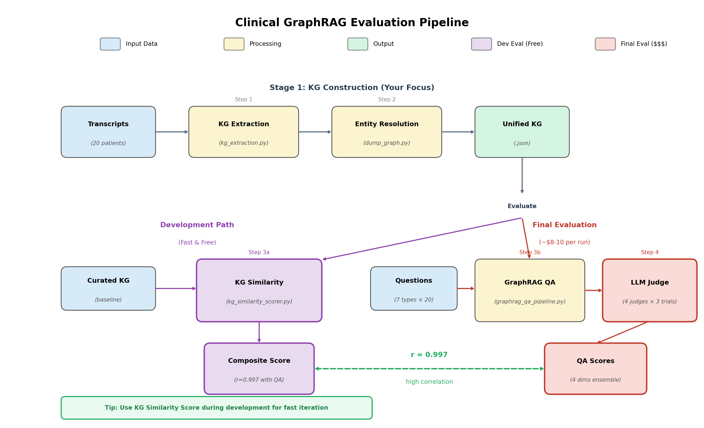
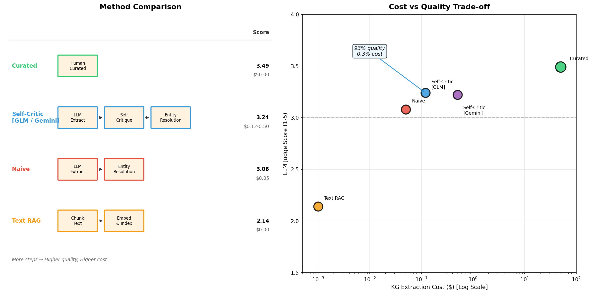

# Clinical GraphRAG Evaluation

Evaluate Knowledge Graph extraction methods for clinical transcripts using GraphRAG QA.

## Hackathon Goal

**Build your own multi-agent KG extraction system** to beat our baselines.

Your task: Design an agentic orchestration pipeline that extracts high-quality Knowledge Graphs from clinical transcripts. We provide the evaluation framework — you bring the innovation.

---

## Pipeline Overview



### Stage 1: KG Construction (Your Focus)

| Step | Script | Purpose |
|------|--------|---------|
| **KG Extraction** | `kg_extraction.py` | Extract entities (symptoms, diagnoses, treatments) and relations from each patient's transcript. This is where your multi-agent system comes in. |
| **Entity Resolution** | `dump_graph.py` | Merge per-patient KGs into a unified graph. Uses BGE-M3 embeddings (0.85 cosine threshold) to deduplicate entities like "high blood pressure" = "hypertension". |

### Stage 2: Evaluation (Provided)

| Step | Script | Purpose |
|------|--------|---------|
| **GraphRAG QA** | `graphrag_qa_pipeline.py` | Given a clinical question, retrieve relevant KG triples and generate an answer. Tests if your KG captures the right information. |
| **LLM Judge** | `llm_judge_batch_parallel.py` | 4 LLM judges (GPT/Claude/Gemini/Grok) × 3 trials score each answer on correctness, completeness, faithfulness, and relevance. |

---

## Baseline Results



| Method | Pipeline | Score | Cost |
|--------|----------|-------|------|
| **Curated** | 3 LLMs voting → Writer-Critic → Human review | 3.49 | $40 |
| **Self-Critic** | LLM extract → Self critique → Merge | 3.24 | $0.12 |
| **Naive** | LLM extract → Merge | 3.08 | $0.05 |
| **Text RAG** | Chunk & embed (no KG) | 2.14 | $0 |

**Takeaway**: Self-Critic achieves **93% quality at 0.3% cost**. Can your multi-agent system do better?

---

## Quick Start

```bash
# Step 1: Setup API keys
cp api_keys_example.json api_keys.json  # Add your OpenRouter/Gemini keys

# Step 2: KG Extraction (replace with YOUR method)
python kg_extraction.py --input evaluation_bundle/transcripts --output my_kg/ --method self-critic

# Step 3: Entity Resolution — merge per-patient KGs
python dump_graph.py --input my_kg/ --output my_unified_graph.json

# Step 4: GraphRAG QA — answer 140 clinical questions
python graphrag_qa_pipeline.py --kg my_unified_graph.json --bundle evaluation_bundle/ --output my_results/

# Step 5: LLM Judge — score your answers
python llm_judge_batch_parallel.py --results my_results/ --output my_scores/

# Step 6: Compare to baseline — quick KG quality check
python kg_similarity_scorer.py --student my_unified_graph.json --baseline baseline_curated/unified_graph_curated.json
```

---

## Project Structure

```
├── evaluation_bundle/     # 20 patients × 7 question types (140 QA pairs)
├── baseline_*/            # Pre-computed baselines with full evaluation
├── figures/               # Visualizations
├── kg_extraction.py       # Baseline extraction (naive / self-critic)
├── dump_graph.py          # Entity resolution & KG merging
├── graphrag_qa_pipeline.py
├── llm_judge_batch_parallel.py
├── kg_similarity_scorer.py
└── visualize.py           # Generate comparison figures
```
