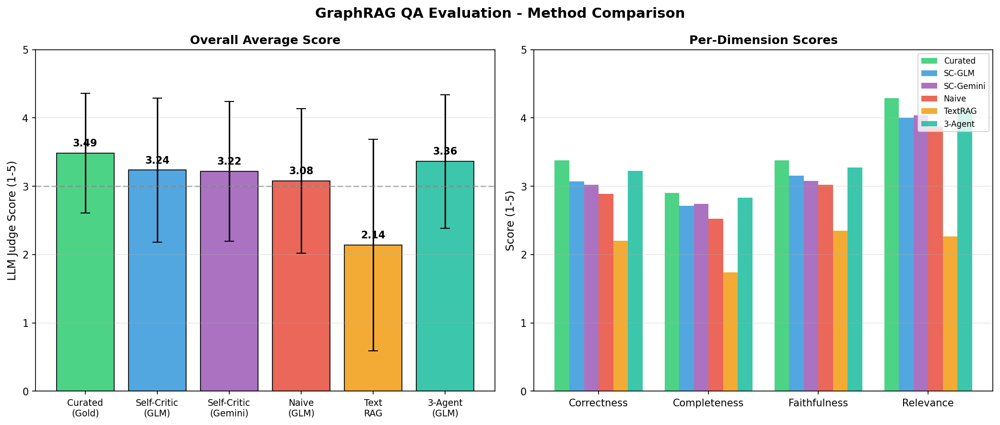
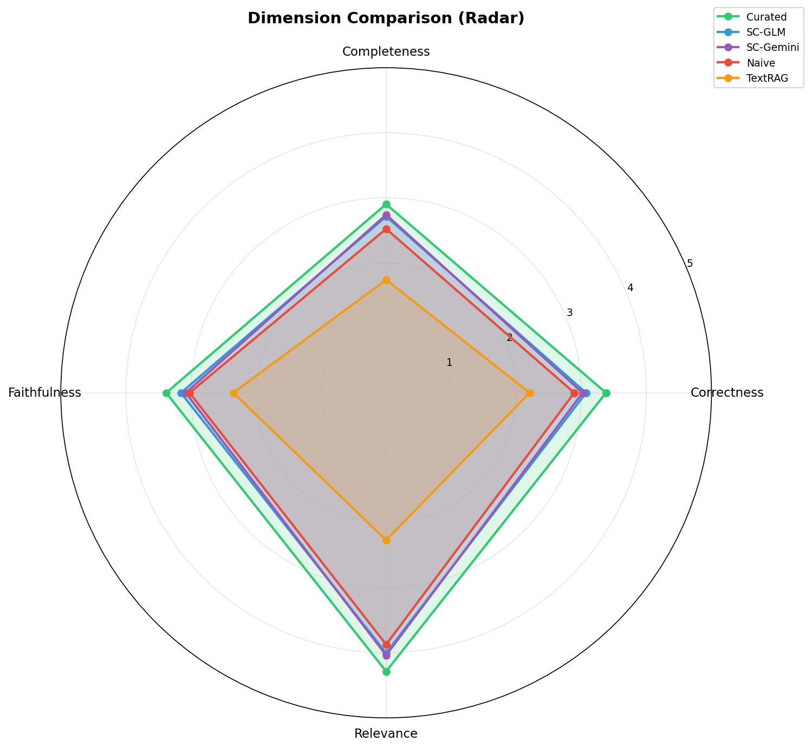
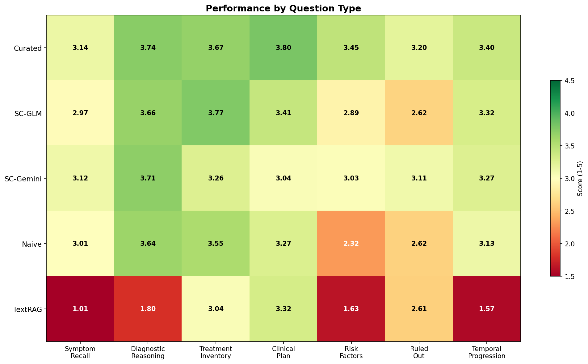
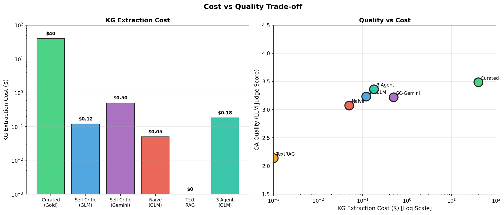

# Clinical GraphRAG Evaluation

Knowledge Graph extraction from clinical transcripts + GraphRAG QA evaluation.

## Key Results

### Method Comparison


| Method | Score | vs Curated | Cost | ROI |
|--------|-------|------------|------|-----|
| Curated (Gold) | 3.49 | 100% | $40 | - |
| Self-Critic GLM | 3.24 | 92.8% | $0.12 | **Best value** |
| Self-Critic Gemini | 3.22 | 92.3% | $0.50 | - |
| Naive | 3.08 | 88.2% | $0.05 | - |
| Text RAG | 2.14 | 61.4% | $0 | - |

**Conclusion**: Self-Critic with GLM-4.7-flash achieves 93% of curated quality at 0.3% of the cost.

### Dimension Analysis


### Question Type Performance


### Cost vs Quality


---

## Quick Start

```bash
# 1. Setup API keys
cp api_keys_example.json api_keys.json

# 2. KG extraction
python kg_extraction.py --input evaluation_bundle/transcripts --output my_kg/ --method self-critic

# 3. Merge graph
python dump_graph.py --input my_kg/ --output my_unified_graph.json

# 4. GraphRAG QA
python graphrag_qa_pipeline.py --kg my_unified_graph.json --bundle evaluation_bundle/ --output my_results/

# 5. LLM Judge
python llm_judge_batch_parallel.py --results my_results/ --output my_scores/

# 6. Compare to baseline
python kg_similarity_scorer.py --student my_unified_graph.json --baseline baseline_curated/unified_graph_curated.json
```

## Project Structure

```
├── evaluation_bundle/     # 20 patients × 7 questions
├── baseline_*/            # Pre-computed baselines
├── figures/               # Visualizations
└── *.py                   # Core scripts
```
