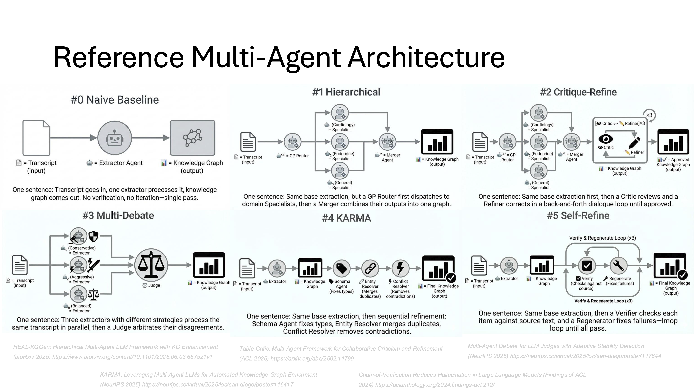
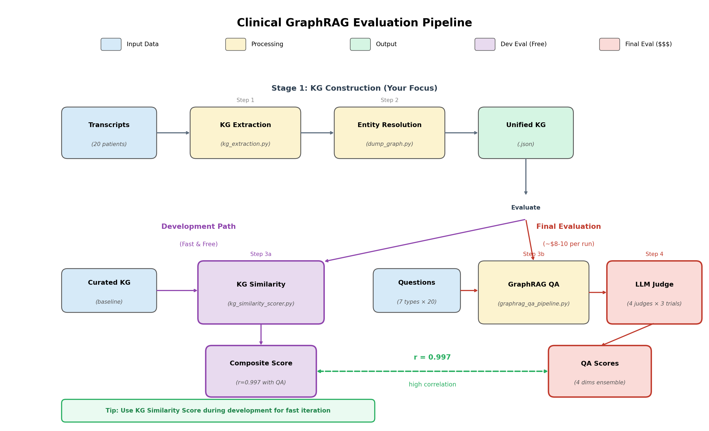

# Clinical GraphRAG Evaluation

Evaluate Knowledge Graph extraction methods for clinical transcripts using GraphRAG QA.

## Hackathon Goal

**Build your own multi-agent KG extraction system** to beat our baselines.

Your task: Design an agentic orchestration pipeline that extracts high-quality Knowledge Graphs from clinical transcripts. We provide the evaluation framework, you bring the innovation.

### Model Restriction

To ensure fair comparison and enable future **local deployment**, KG extraction may use **these OpenRouter models**:

| Model | Notes |
|-------|-------|
| `z-ai/glm-4.7-flash` | Our baseline model |
| `qwen/qwen3-14b` | |
| `nvidia/nemotron-3-nano-30b-a3b` | |
| `openai/gpt-oss-20b` | |
| `deepseek/deepseek-r1-distill-qwen-32b` | |

See `kg_extraction.py` for API usage reference.

### Possible Architecture Directions

A few possible architectures you may want to pursue but are not limited to:



## Quick Start

```bash
# Step 0: Install uv and dependencies
# Install uv: https://docs.astral.sh/uv/getting-started/installation/
curl -LsSf https://astral.sh/uv/install.sh | sh

# Sync project dependencies (from project root)
uv sync

# Step 1: Setup API keys
cp api_keys_example.json api_keys.json
# Edit api_keys.json and replace "sk-or-v1-your-openrouter-api-key-here" with your key from https://openrouter.ai/keys (The other keys are optional and not required)

# Step 2: KG Extraction (replace this script with YOUR method)
uv run python -m Clinical_KG_OS_LLM.kg_extraction --output ./my_kg

# Step 3: Entity Resolution - merge per-patient KGs into unified graph
uv run python -m Clinical_KG_OS_LLM.dump_graph --input ./my_kg --output ./my_kg_naive

# Step 4: GraphRAG QA - answer clinical questions (omit --questions to run all)
# Uses ./data/transcripts by default; pass --bundle DIR to override
uv run python -m Clinical_KG_OS_LLM.graphrag_qa_pipeline \
  --kg ./my_kg_naive/unified_graph_my_kg.json

# Step 5: Quick quality check - compare against curated baseline
uv run python -m Clinical_KG_OS_LLM.kg_similarity_scorer \
  --student ./my_kg_naive/unified_graph_my_kg.json \
  --baseline ./src/Clinical_KG_OS_LLM/baseline_results/baseline_curated/unified_graph_curated.json

# Step 6: Visualize the knowledge graph
uv run python -m Clinical_KG_OS_LLM.visualize_kg \
  --kg ./my_kg_naive/unified_graph_my_kg.json \
  --output ./my_kg_naive/kg_graph.png
```

**Path notes:**
- `dump_graph` writes `unified_graph_{input_dir_name}.json` (e.g. `unified_graph_my_kg.json` when `--input ./my_kg`)
- `graphrag_qa_pipeline` writes results to `{kg_parent}/results_{kg_stem}/` by default (e.g. `./my_kg_naive/results_unified_graph_my_kg`)

### Quick Start Notebook

Prefer running in a notebook? Use `notebooks/quickstart.ipynb` to run Steps 0–6 interactively. Install Jupyter Lab first with `uv sync --extra jupyter`, then run `jupyter lab` to open the notebook.

## Pipeline Overview



### Stage 1: KG Construction (Your Focus)

| Step | Script | Purpose |
|------|--------|---------|
| **KG Extraction** | `kg_extraction.py` | Extract entities (symptoms, diagnoses, treatments) and relations from each patient's transcript. This is where your multi-agent system comes in. |
| **Entity Resolution** | `dump_graph.py` | Merge per-patient KGs into a unified graph. Uses [BGE-M3](https://arxiv.org/abs/2402.03216) embeddings (0.85 cosine threshold) to deduplicate entities like "high blood pressure" = "hypertension". |

### Stage 2: Evaluation (Provided)

| Step | Script | Purpose |
|------|--------|---------|
| **GraphRAG QA** | `graphrag_qa_pipeline.py` | Given a clinical question, retrieve relevant KG triples and generate an answer. Tests if your KG captures the right information. |
| **LLM Judge** | `llm_judge_batch_parallel.py` | 4 LLM judges (GPT/Claude/Gemini/Grok) × 3 trials score each answer on correctness, completeness, faithfulness, and relevance. Based on [LLM-as-Judge](https://arxiv.org/abs/2306.05685) methodology. This will be run by the project lead to evaluate your solutions. |

### Evaluation

Based on the [IEEE TKDE Survey on KG Quality Management](https://ieeexplore.ieee.org/document/9709663/) (Xue et al. 2022), we use a **composite KG score** that correlates **r = 0.94** with final QA performance:

| Component | Weight | Description |
|-----------|--------|-------------|
| Entity F1 | 25% | Node overlap with curated baseline |
| Population Completeness | 25% | Node count coverage |
| Relation Completeness | 25% | Edge count coverage |
| Schema Completeness | 25% | Node type coverage |

| Method | Composite Score | QA Score |
|--------|-----------------|----------|
| Naive | 0.562 | 3.08 |

> **Note for Participants**: The LLM Judge evaluation is **expensive** (~$8-10 per full run) and will be executed by hackathon organizers for final scoring. During development, use `kg_similarity_scorer.py` to get your **composite score**, a reliable low-cost proxy for QA performance.

## Project Structure

```
├── data/
│   └── transcripts/               # Evaluation bundle: 20 patients × 7 question types (140 QA pairs)
├── src/Clinical_KG_OS_LLM/
│   ├── kg_extraction.py           # Baseline single-pass extraction (OpenRouter GLM) — USE AS REFERENCE
│   ├── dump_graph.py              # Entity resolution & KG merging
│   ├── graphrag_qa_pipeline.py
│   ├── llm_judge_batch_parallel.py
│   ├── kg_similarity_scorer.py
│   └── baseline_results/          # Pre-computed baselines with full evaluation (if present)
├── notebooks/quickstart.ipynb     # Interactive tutorial
├── figures/                       # Visualizations
└── pyproject.toml                 # Dependencies (use `uv sync`)
```

## Additional Challenge: Speech-to-Text

Each patient folder includes the original `.mp3` audio recording. While we provide pre-generated transcripts, teams can optionally experiment with ASR. We hope to see teams that can provide **high-quality, low-cost solutions** that go directly from `.mp3` audio to Knowledge Graph.

**Open-source SOTA**: [OpenAI Whisper](https://github.com/openai/whisper) ([Radford et al. 2022](https://arxiv.org/abs/2212.04356))

```bash
# Install (requires ffmpeg)
pip install openai-whisper
conda install ffmpeg  # if not installed
```

**Baseline Results** (Whisper base model on 20 transcripts):
- Average WER: 16.7%
- Accuracy: 83.3%
